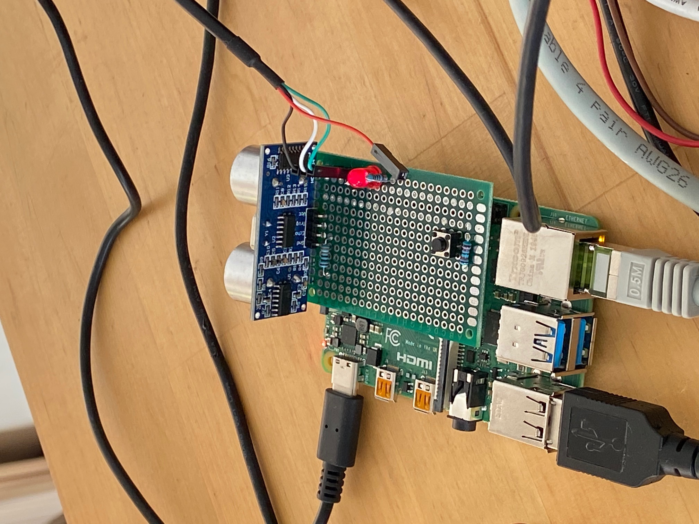

# distance-measurement-rpi

[![Contributors][contributors-shield]][contributors-url]
[![GNU License][license-shield]][license-url]
[![LinkedIn][linkedin-shield]][linkedin-url]

<!-- PROJECT LOGO -->
<br />
<p align="center">
  <a href="https://github.com/heiko-haeusser/distance-measurement-rpi">
    
  </a>

  <h3 align="center">RPI4 Project Ultrasonic Sensor Board V1.1</h3>

  <p align="center">
    Hardware Related CPP course - week 4 final Projekt
    <br />
    <a href="https://github.com/heiko-haeusser/distance-measurement-rpi"><strong>Explore the docs »</strong></a>
    <br />
    <br />
  </p>
</p>

<!-- TABLE OF CONTENTS -->
## Table of Contents

* [About the Project](#about-the-project)
* [Installation](#installation)
* [Usage](#usage)
* [Roadmap](#roadmap)
* [Conclusion](#conclusion)
* [License](#license)
* [Contact](#contact)
* [Acknowledgements](#acknowledgements)


<!-- ABOUT THE PROJECT -->
## About The Project


The aim of the project is the development of a distance measurement for a RPI custom board with LED, Button and Ultrasonic Sensor.
The given code supports custom board version V1.1<br /><br />
Logging on USB with automatically mounted storage is planned for the future.
##!!!Important Notice: All the tasks for distance measurement are designed to run until the button is pressed!!!

The Board has the following IO configuration:<br />
<table>
	<thead>
		<tr>
			<td style="text-align: center" size="8"><b>Function</b></td>
			<td style="text-align: center" size="15"><b>GPIO</b></td>
		</tr>
	</thead>
	<tbody>
		<tr>
			<td style="text-align: center">Button</td>
			<td style="text-align: center">GPIO26</td>
		</tr>
		<tr>
			<td style="text-align: center">Pullup Button</td>
			<td style="text-align: center">GPIO13</td>
		</tr>
		<tr>
			<td style="text-align: center">LED</td>
			<td style="text-align: center">GPIO23</td>
		</tr>
		<tr>
			<td style="text-align: center">UltrasonicSensor</td>
			<td style="text-align: center"> </td>
		</tr>
		<tr>
			<td style="text-align: center">Trigger</td>
			<td style="text-align: center">GPIO18</td>
		</tr>
		<tr>
			<td style="text-align: center">Echo</td>
			<td style="text-align: center">GPIO24</td>
		</tr>
	</tbody>
</table>


### The project can be separated in the following main tasks:
1. Development of a Custom Kernel module that interfaces a distance sensor (last task)<br />
2. C++ Application to access sensor data and control status LED (first task)<br />
3. Custom logging with temporary storage<br />

### Additional goals are:
4. Simple system setup using shell script for deployment (side task)<br />
5. Project setup with installation from external drive (e.g. USB stick) in mind<br />

## Installation

1. Clone the repo
```sh
git clone https://github.com/heiko-haeusser/distance-measurement-rpi.git
```

2. make install script excecutable
```sh
sudo chmod +x install.sh
sudo chmod +x uninstall.sh
```

2. run install script (install.sh)<br />
parameters: [-shell] [-cpp] [-km] [-task5]<br />
  -shell: installs the solution from task 2 <br />
  -cpp: installs the solution as cpp solution<br />
  -km: installs the solution as kernel module<br />
  -task5: installs a CPU and RAM load logger to tempfs mounted in /media/sensor_logs/<br />
```sh
sudo ./install.sh
```

<!-- USAGE EXAMPLES -->
## Usage

short _how-to_ goes here in the future

<!-- ROADMAP -->
## Roadmap

Task description:<br />
### Task 1. Setup of a git repo with this readme file
#### Task 1a: Prepare already an install script. Makes life easier..(install script, will be adjusted during development)
Development of a install script which automatically deploys all necessary sources to the specified locations<br />

  #### a) parameters: [-shell]<br />
  -shell: installs the solution from task 2 <br />

### 1.b Project setup with installation from external drive (e.g. USB stick) in mind
not clear what needs to be done here
### Task 2. Shell Script Application to access GPIO and control status LED
Task description: Write a simple shell script that sets up GPIO23 (the LED) as output and let it blink twice with a cycle time of 1s.

### Task 3. C++ Application to access sensor data, control status LED and perform measurement
3a. Write a simple C++ application that compiles and runs on the target hardware.
=> done with draft commit

3b. An implementation with object-oriented architecture that is able to read values from GPIO,
forward them to a processing component for the runtime calculations and blink the LED according
to a classification based on the distance of an object (1 s interval OK, 300 ms interval
Warning, 20 ms interval Stop). There shall be one measurement every 500 ms. The result of a
successful distance measurement shall be printed on standard output.

#### Description of the SW Architecture:
The Application is divided in parts:<br />
##### 1. Sysfs Interface to control the GPIOs<br />
This part is defined as an abstract class Custom_Gpio with the two derived classes Custom_Gpo and Custom_Gpi.<br />
The base class holds all necessary functionality which is necessary to configure a GPIO (e.g. sysfs gpio export/unexport interface, sysfs gpio direction config).<br />
On top of that the derived class Custom_Gpo holds all necessary functionality which is only relevant for an _output_ (e.g. to set sysfs gpio value).<br />
The derived class Custom_Gpi holds all necessary functionality which is only relevant for an _input_ (e.g. to set sysfs gpio value).<br />
There are two threads planned, one for doing the measurement and another one for flashing the LED.<br />
###### Description of components:
Custom_Gpio:
```cpp
	virtual int setupGpio(void) = 0; //abstract function to do the whole initialization 
	int exportGpio(void); //sysfs export interface
	int setGpioDir(void); //sysfs direction interface (in/out)
	int unexportGpio(void); //sysfs unexport interface
```
Custom_Gpo:
```cpp
	Custom_Gpo(); //constructor
	Custom_Gpo(int _gpio_number, std::string _gpio_direction, int _gpio_value); //user defined constructor

	virtual ~Custom_Gpo(); //distructor
	Custom_Gpo(const Custom_Gpo &other); //copy constructor
	int setupGpio(void);
	int setGpioValue(int value);
```
Custom_Gpi:
```cpp
	Custom_Gpi(); //constructor
	Custom_Gpi(int _gpio_number, std::string _gpio_direction); //user defined constructor

	virtual ~Custom_Gpi(); //distructor
	Custom_Gpi(const Custom_Gpi &other); //copy constructor
	int setupGpio(void); //function to do the whole initialization for an input pin
	int getGpioValue(); //returns the input state as an integer value
```

##### 2. GPIO Manager
The GPIO_Manager class implements a first abstraction to the user. GPIOs are only initialized and controlled, even the functionality is mapped to the function (e.g. gpio_led which holds the correct pin for the LED output).<br />
```cpp
	Gpio_Manager(); //constructor
	virtual ~Gpio_Manager(); //distructor
	Gpio_Manager(const Gpio_Manager &other); //copy constructor
	Gpio_Manager& operator=(const Gpio_Manager &other); //copy assignment
	
	void initGpios(void); //function to do the whole initialization for all used pins
	void deinitGpios(void); //function to do the whole uninitialization for all used pins

	void setLED(bool val); //switches the LED on and off
	void setTrigger(bool val);//switches the trigger pin on and off
	void setBtnPullup(bool val); //switches the pullup/VCC for the button on and off
	bool readBtnState(void); //returns if the button is pressed 
	bool readEchoState(void); //returns if the echo pin is high 
```
##### 3. Ultrasonic Sensor Component
The Ultrasonic Sensor Component implements an abstracted interface to the ultrasonic sensor.

```cpp
	has a pointer to the Gpio_Manager 

	Ultrasonic_Sensor(Gpio_Manager &gpioMgr); //constructor
	virtual ~Ultrasonic_Sensor(); //distructor
	void initiateTrigger(void); //function to initiate the ultrasonic signal to be sent out
	int captureEcho(void); //function to capture the echo and calculate the duration of the pulse
	double calculateDistance(void); //function to calculate the distance to an obstacle based on the last measured duration
	void performMeasurement(void); //does all in one (whole distance measurement including trigger)
	
	int getDistanceCm();
	void setDistanceCm(int distanceCm);
	double getDistanceM();
	void setDistanceM(double distanceM);
	int getDuration();
	void setDuration(int duration);
	const Gpio_Manager& getGpioMgr();
	void setGpioMgr(const Gpio_Manager &gpioMgr);
```
##### 4. Parking Distance Component
The Parking Distance Component implements controls the LED according to the measured distance from the Ultrasonic Sensor Component.

```cpp
	has a pointer to the Gpio_Manager and to the Ultrasonic_Sensor
	
	void toggleLED(void); //toggle the LED with the updated frequency from the measurement thread
```
.<br />

### Task 4: Systemd service unit
Write a service unit that starts the PDC C++ application at boot time (target multi-user).<br />
Just small adjustments in the distance-measurement-rpi.service file. See install.sh for further information. <br />

This one is mostly recycled from excercises of this week, if solved an easy one.<br />
### Task 5: Logging & logging filesystem
Write a timer unit that runs a script that writes current RAM and CPU usage every 5s into a file stored on a tmpfs.<br />

This was completely solved using the man pages (tempfs, top) and the internet (CPU usage :))<br />
If solved correctly, also an easy one.
### Task 6: Custom kernel module
Write a simple kernel module that can be loaded. Implement the distance measurement
from Task 3 as part of this module with an interval of 500 ms. Between each measurement
the connected LED shall flash for 50 ms. For test purposes the measured distance
shall be printed to the kernel log.

Initial consideration:
Jiffies do not offer the necessary precision for the timer. I did already a little research during this week on timers and linux (because of preemt_rt), therefore I decided to use hrtimer instead.

SW Architecture:
Due to the fact that the solution will be a little simpler to solve than the OO solution from Task 3, the SW Architecture is also different.

What do we need:
A timer which initiates a distance measurement (and switches the LED).

timer func:
a simple state machine is implemented to control output pins<br />
- state 0: set LED and trigger pin to 1 => timer value set to 15us.<br />
- state 1: clear trigger pin to 0 => timer value set to 50ms.<br />
- state 2: clear LED pin to 0, clear state to initial state 0 => timer value set to 450ms.<br />


The echo and duration of the pulse is solved via IRQ for the echo pin which stores the timestamp and evaluates the distance if the result is valid.<br />
I observed that sometimes two falling edges are processed without a rising edge inbetween. Due that the condition to evaluate the measurement was modified to only calculate if a rising edge was detected before the falling edge is processed.<br />

## Conclusion

The whole week and the final project were challenging, but doable. <br /><br />
Many thanks to our Linux coach Alexander Nassian, who did great classes and gave a very deep insight in Linux and Bash.<br /><br />
The development of project was a lot of fun and very interesting, especially the little hickups when the project grew up.<br />
One interesting finding was in the final test it pointed out that the kernel module could not be built because of missing dependencies. <br />
Here is how I solved it: Upgrade of the kernel and install of the headers<br />
```sh
	sudo apt-get dist-upgrade
	sudo apt-get install linux-headers-$(uname -r)
	sudo apt-get install raspberrypi-kernel-headers
	
```

During this week I'll add also some videos and screenshots to show the functionality.

<!-- LICENSE -->


## License

Distributed under the GPLv3 License. See [LICENSE](https://github.com/heiko-haeusser/distance-measurement-rpi/blob/main/LICENSE) for more information.


<!-- CONTACT -->
## Contact

Heiko Haeusser - heiko.haeusser@web.de

Project Link: [https://github.com/heiko-haeusser/distance-measurement-rpi](https://github.com/heiko-haeusser/distance-measurement-rpi)


<!-- MARKDOWN LINKS & IMAGES -->
<!-- https://www.markdownguide.org/basic-syntax/#reference-style-links -->
[contributors-shield]: https://img.shields.io/github/contributors/heiko-haeusser/repo.svg?style=flat-square
[contributors-url]: https://github.com/heiko-haeusser/repo/graphs/contributors
[forks-shield]: https://img.shields.io/github/forks/heiko-haeusser/repo.svg?style=flat-square
[forks-url]: https://github.com/heiko-haeusser/repo/network/members
[stars-shield]: https://img.shields.io/github/stars/heiko-haeusser/repo.svg?style=flat-square
[stars-url]: https://github.com/heiko-haeusser/repo/stargazers
[issues-shield]: https://img.shields.io/github/issues/heiko-haeusser/repo.svg?style=flat-square
[issues-url]: https://github.com/heiko-haeusser/repo/issues
[license-shield]: https://img.shields.io/github/license/heiko-haeusser/repo.svg?style=flat-square
[license-url]: https://github.com/heiko-haeusser/distance-measurement-rpi/blob/main/LICENSE
[linkedin-shield]: https://img.shields.io/badge/-LinkedIn-black.svg?style=flat-square&logo=linkedin&colorB=555
[linkedin-url]: https://linkedin.com/in/heiko-haeusser
